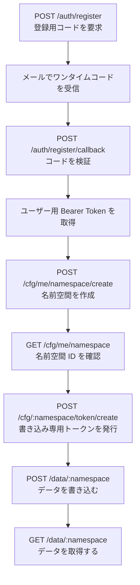
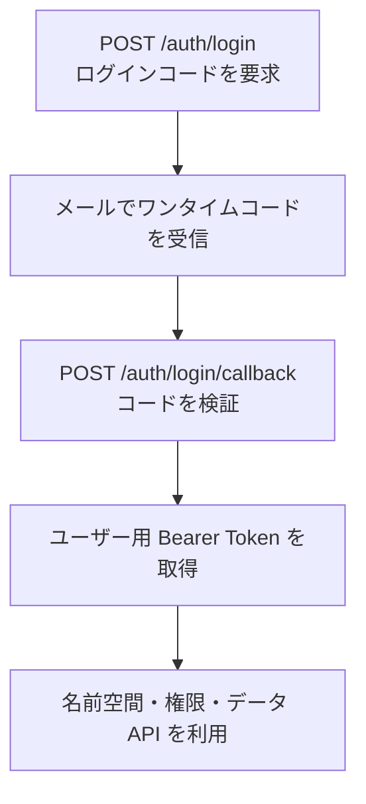
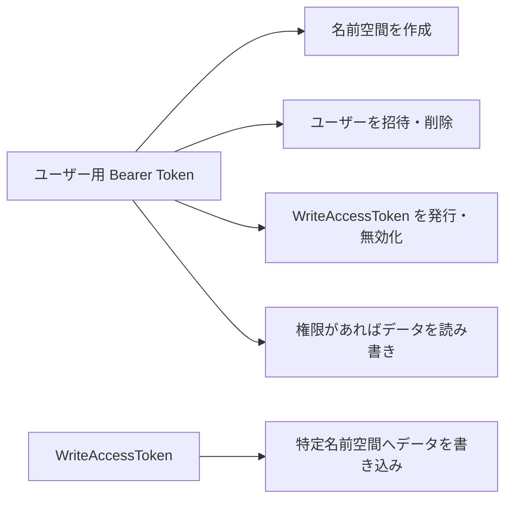

# 利用フロー

## 1. API の概要

この API は、名前空間ごとに時系列の Key-Value データを保存・取得するための API です。

Swagger 定義上の API バージョンとベースパスは次のとおりです。

```text
API Version: 0.0.1
Base Path: /api/v1
```

したがって、API のホスト名が `https://example.com` の場合、API のベース URL は次のようになります。

```bash
export API_ORIGIN="https://example.com"
export API_BASE="${API_ORIGIN}/api/v1"
```

以降の例では、次の環境変数を使用します。

```bash
export API_ORIGIN="https://example.com"
export API_BASE="${API_ORIGIN}/api/v1"

export EMAIL="user@example.com"
export USER_NAME="example-user"

# 認証完了後に設定する
export USER_TOKEN=""

# 名前空間作成後に設定する
export NAMESPACE_ID=""

# WriteAccessToken 発行後に設定する
export WRITE_TOKEN=""
```

---

## 2. 全体の流れ

新規ユーザーの場合は、次の順番で API を辿ります。



既存ユーザーの場合は、登録処理の代わりにログイン処理を行います。



---

# 3. 新規ユーザー登録

## 3.1 登録用ワンタイムコードを要求する

```http
POST /api/v1/auth/register
```

名前とメールアドレスを送信すると、登録用のワンタイムコードがメールで送信されます。成功時のステータスコードは `201 Created` で、レスポンスボディはありません。

### curl

```bash
curl --fail-with-body \
  --request POST \
  "${API_BASE}/auth/register" \
  --header "Content-Type: application/json" \
  --data '{
    "name": "'"${USER_NAME}"'",
    "email": "'"${EMAIL}"'"
  }'
```

リクエストボディでは `name` と `email` の両方が必須です。

### リクエスト例

```json
{
  "name": "example-user",
  "email": "user@example.com"
}
```

### 成功レスポンス

```text
HTTP/1.1 201 Created
```

---

## 3.2 登録用ワンタイムコードを検証する

メールで受信したコードを使って、ユーザー登録を完了します。

```http
POST /api/v1/auth/register/callback
```

成功すると、以降の管理 API で使用するユーザー用 Bearer Token が返却されます。

```bash
export REGISTER_CODE="メールで受信したコード"
```

### curl

```bash
curl --fail-with-body \
  --request POST \
  "${API_BASE}/auth/register/callback" \
  --header "Content-Type: application/json" \
  --data '{
    "email": "'"${EMAIL}"'",
    "code": "'"${REGISTER_CODE}"'"
  }'
```

`email` と `code` はどちらも必須です。

### レスポンス例

```json
{
  "id": 1,
  "user_id": "xxxxxxxx-xxxx-xxxx-xxxx-xxxxxxxxxxxx",
  "token": "USER_BEARER_TOKEN",
  "created_at": "2026-07-21T00:00:00Z",
  "updated_at": "2026-07-21T00:00:00Z",
  "expires_at": "2026-08-21T00:00:00Z"
}
```

レスポンスの `token` を保存します。

```bash
export USER_TOKEN="USER_BEARER_TOKEN"
```

`jq` が利用できる場合は、次のように直接取り出せます。

```bash
export USER_TOKEN="$(
  curl --silent --show-error --fail-with-body \
    --request POST \
    "${API_BASE}/auth/register/callback" \
    --header "Content-Type: application/json" \
    --data '{
      "email": "'"${EMAIL}"'",
      "code": "'"${REGISTER_CODE}"'"
    }' |
  jq --raw-output '.token'
)"
```

---

# 4. 既存ユーザーのログイン

新規登録済みの場合は、登録 API ではなくログイン API を使用します。

## 4.1 ログイン用ワンタイムコードを要求する

```http
POST /api/v1/auth/login
```

メールアドレスを送信すると、ログイン用のワンタイムコードがメールで送信されます。成功時は `204 No Content` です。

### curl

```bash
curl --fail-with-body \
  --request POST \
  "${API_BASE}/auth/login" \
  --header "Content-Type: application/json" \
  --data '{
    "email": "'"${EMAIL}"'"
  }'
```

### 成功レスポンス

```text
HTTP/1.1 204 No Content
```

---

## 4.2 ログイン用ワンタイムコードを検証する

```http
POST /api/v1/auth/login/callback
```

メールアドレスとコードを送信すると、ユーザー用 Bearer Token が返却されます。

```bash
export LOGIN_CODE="メールで受信したコード"
```

### curl

```bash
curl --fail-with-body \
  --request POST \
  "${API_BASE}/auth/login/callback" \
  --header "Content-Type: application/json" \
  --data '{
    "email": "'"${EMAIL}"'",
    "code": "'"${LOGIN_CODE}"'"
  }'
```

### Bearer Token を変数へ保存する例

```bash
export USER_TOKEN="$(
  curl --silent --show-error --fail-with-body \
    --request POST \
    "${API_BASE}/auth/login/callback" \
    --header "Content-Type: application/json" \
    --data '{
      "email": "'"${EMAIL}"'",
      "code": "'"${LOGIN_CODE}"'"
    }' |
  jq --raw-output '.token'
)"
```

---

# 5. 認証ヘッダー

認証が必要な API では、`Authorization` ヘッダーに Bearer Token を指定します。

Swagger では `Authorization` ヘッダーを利用する `apiKey` 型の認証として定義されています。

```bash
--header "Authorization: Bearer ${USER_TOKEN}"
```

基本形は次のとおりです。

```bash
curl --fail-with-body \
  --request GET \
  "${API_BASE}/認証が必要なエンドポイント" \
  --header "Authorization: Bearer ${USER_TOKEN}"
```

> Swagger の定義上はヘッダー名しか規定されていませんが、各説明では「Bearer Token」と呼ばれているため、例では `Bearer <token>` の形式を使用しています。

---

# 6. 名前空間を作成する

データは名前空間単位で管理されます。

## 6.1 名前空間を作成する

```http
POST /api/v1/cfg/me/namespace/create
```

認証済みユーザーとして新しい KVS 名前空間を作成します。成功時は `201 Created` で、レスポンスボディはありません。

### curl

```bash
curl --fail-with-body \
  --request POST \
  "${API_BASE}/cfg/me/namespace/create" \
  --header "Authorization: Bearer ${USER_TOKEN}"
```

### 成功レスポンス

```text
HTTP/1.1 201 Created
```

このエンドポイントは、作成した名前空間 ID をレスポンスとして返しません。そのため、作成後に名前空間一覧を取得して ID を確認します。

---

## 6.2 利用可能な名前空間を取得する

```http
GET /api/v1/cfg/me/namespace
```

現在のユーザーがアクセスできる名前空間と、その権限を取得します。`offset` クエリパラメータを指定できます。

### curl

```bash
curl --fail-with-body \
  --request GET \
  "${API_BASE}/cfg/me/namespace?offset=0" \
  --header "Authorization: Bearer ${USER_TOKEN}"
```

### レスポンス例

```json
[
  {
    "namespace_id": "xxxxxxxx-xxxx-xxxx-xxxx-xxxxxxxxxxxx",
    "grant_type": "admin"
  }
]
```

レスポンスには、名前空間 ID と権限種別が含まれます。

名前空間 ID を保存します。

```bash
export NAMESPACE_ID="xxxxxxxx-xxxx-xxxx-xxxx-xxxxxxxxxxxx"
```

一覧の先頭から取得する場合は、次のようにできます。

```bash
export NAMESPACE_ID="$(
  curl --silent --show-error --fail-with-body \
    --request GET \
    "${API_BASE}/cfg/me/namespace?offset=0" \
    --header "Authorization: Bearer ${USER_TOKEN}" |
  jq --raw-output '.[0].namespace_id'
)"
```

---

# 7. WriteAccessToken を発行する

IoT 機器など、データの書き込みだけを行うクライアントには、ユーザー用トークンを渡すのではなく、名前空間専用の WriteAccessToken を発行します。

```http
POST /api/v1/cfg/{namespace}/token/create
```

パスの `{namespace}` には名前空間の UUID を指定します。

### curl

```bash
curl --fail-with-body \
  --request POST \
  "${API_BASE}/cfg/${NAMESPACE_ID}/token/create" \
  --header "Authorization: Bearer ${USER_TOKEN}"
```

### レスポンス例

```json
{
  "id": 1,
  "namespace_id": "xxxxxxxx-xxxx-xxxx-xxxx-xxxxxxxxxxxx",
  "token": "WRITE_ACCESS_TOKEN",
  "created_by_user_id": "yyyyyyyy-yyyy-yyyy-yyyy-yyyyyyyyyyyy",
  "created_at": "2026-07-21T00:00:00Z",
  "updated_at": "2026-07-21T00:00:00Z",
  "expires_at": "2026-08-21T00:00:00Z",
  "created_by": {
    "id": "yyyyyyyy-yyyy-yyyy-yyyy-yyyyyyyyyyyy",
    "name": "example-user",
    "email": "user@example.com"
  }
}
```

WriteAccessToken のレスポンスには、トークン本体、名前空間 ID、有効期限、作成者などが含まれます。

```bash
export WRITE_TOKEN="WRITE_ACCESS_TOKEN"
```

`jq` で取得する場合は次のとおりです。

```bash
export WRITE_TOKEN="$(
  curl --silent --show-error --fail-with-body \
    --request POST \
    "${API_BASE}/cfg/${NAMESPACE_ID}/token/create" \
    --header "Authorization: Bearer ${USER_TOKEN}" |
  jq --raw-output '.token'
)"
```

---

# 8. データを書き込む

```http
POST /api/v1/data/{namespace}
```

指定した名前空間に、時刻付きの Key-Value データを一括登録します。成功時は空の JSON オブジェクト `{}` が返ります。

## 8.1 リクエスト構造

リクエストは次の構造です。

```json
{
  "keyValueWithTime": [
    {
      "time": 1784563200,
      "keyValues": [
        {
          "key": "temperature",
          "value": "25.4"
        },
        {
          "key": "humidity",
          "value": "60"
        }
      ]
    }
  ]
}
```

`keyValueWithTime` は配列で、各要素に UNIX 時刻の `time` と、複数の `keyValues` を指定します。`key` と `value` はどちらも文字列です。

---

## 8.2 ユーザー用 Bearer Token で書き込む

対象名前空間への書き込み権限があるユーザーは、ユーザー用トークンを利用できます。

```bash
curl --fail-with-body \
  --request POST \
  "${API_BASE}/data/${NAMESPACE_ID}" \
  --header "Authorization: Bearer ${USER_TOKEN}" \
  --header "Content-Type: application/json" \
  --data '{
    "keyValueWithTime": [
      {
        "time": 1784563200,
        "keyValues": [
          {
            "key": "temperature",
            "value": "25.4"
          },
          {
            "key": "humidity",
            "value": "60"
          }
        ]
      }
    ]
  }'
```

---

## 8.3 WriteAccessToken で書き込む

IoT 機器などから書き込む場合は、発行した WriteAccessToken を利用します。

```bash
curl --fail-with-body \
  --request POST \
  "${API_BASE}/data/${NAMESPACE_ID}" \
  --header "Authorization: Bearer ${WRITE_TOKEN}" \
  --header "Content-Type: application/json" \
  --data '{
    "keyValueWithTime": [
      {
        "time": 1784563200,
        "keyValues": [
          {
            "key": "temperature",
            "value": "25.4"
          },
          {
            "key": "humidity",
            "value": "60"
          }
        ]
      }
    ]
  }'
```

### 成功レスポンス

```json
{}
```

---

## 8.4 複数時刻をまとめて書き込む

```bash
curl --fail-with-body \
  --request POST \
  "${API_BASE}/data/${NAMESPACE_ID}" \
  --header "Authorization: Bearer ${WRITE_TOKEN}" \
  --header "Content-Type: application/json" \
  --data '{
    "keyValueWithTime": [
      {
        "time": 1784563200,
        "keyValues": [
          {
            "key": "temperature",
            "value": "25.4"
          },
          {
            "key": "humidity",
            "value": "60"
          }
        ]
      },
      {
        "time": 1784563260,
        "keyValues": [
          {
            "key": "temperature",
            "value": "25.6"
          },
          {
            "key": "humidity",
            "value": "59"
          }
        ]
      }
    ]
  }'
```

---

# 9. データを取得する

```http
GET /api/v1/data/{namespace}
```

名前空間から、条件に一致する Key-Value データを取得します。

## 9.1 利用可能なクエリパラメータ

| パラメータ      |       型 | 内容                             |
| ---------- | ------: | ------------------------------ |
| `beforeAt` | integer | 指定 UNIX 時刻以前のデータを取得            |
| `afterAt`  | integer | 指定 UNIX 時刻以後のデータを取得            |
| `offset`   | integer | 取得開始位置                         |
| `limit`    | integer | 最大取得件数。最大 50 件                 |
| `key`      |  string | 特定のキー名で絞り込み                    |
| `order`    |  string | `ASC` または `DESC`。デフォルトは `DESC` |

---

## 9.2 名前空間内のデータを取得する

```bash
curl --fail-with-body \
  --request GET \
  "${API_BASE}/data/${NAMESPACE_ID}" \
  --header "Authorization: Bearer ${USER_TOKEN}"
```

---

## 9.3 キー名で絞り込む

```bash
curl --fail-with-body \
  --get \
  "${API_BASE}/data/${NAMESPACE_ID}" \
  --header "Authorization: Bearer ${USER_TOKEN}" \
  --data-urlencode "key=temperature"
```

---

## 9.4 件数と並び順を指定する

```bash
curl --fail-with-body \
  --get \
  "${API_BASE}/data/${NAMESPACE_ID}" \
  --header "Authorization: Bearer ${USER_TOKEN}" \
  --data-urlencode "limit=50" \
  --data-urlencode "offset=0" \
  --data-urlencode "order=DESC"
```

---

## 9.5 時刻範囲を指定する

```bash
curl --fail-with-body \
  --get \
  "${API_BASE}/data/${NAMESPACE_ID}" \
  --header "Authorization: Bearer ${USER_TOKEN}" \
  --data-urlencode "afterAt=1784563200" \
  --data-urlencode "beforeAt=1784649600" \
  --data-urlencode "order=ASC"
```

---

## 9.6 条件を組み合わせる

```bash
curl --fail-with-body \
  --get \
  "${API_BASE}/data/${NAMESPACE_ID}" \
  --header "Authorization: Bearer ${USER_TOKEN}" \
  --data-urlencode "key=temperature" \
  --data-urlencode "afterAt=1784563200" \
  --data-urlencode "beforeAt=1784649600" \
  --data-urlencode "offset=0" \
  --data-urlencode "limit=50" \
  --data-urlencode "order=ASC"
```

### レスポンス例

```json
{
  "timeValueWithKey": [
    {
      "key": "temperature",
      "values": [
        {
          "time": 1784563200,
          "value": "25.4"
        },
        {
          "time": 1784563260,
          "value": "25.6"
        }
      ]
    }
  ]
}
```

レスポンスはキーごとにグループ化され、各キーの `values` に時刻と値の組が格納されます。

---

# 10. 名前空間に別ユーザーを招待する

```http
POST /api/v1/cfg/{namespace}/invite
```

メールアドレスを指定して、名前空間へのアクセス権を付与します。

### 権限種別

| `grant_type` | 意味   |
| ------------ | ---- |
| `r`          | 読み取り |
| `w`          | 書き込み |
| `rw`         | 読み書き |
| `admin`      | 管理権限 |

Swagger で許可されている値は `r`、`w`、`rw`、`admin` です。

### curl

```bash
export INVITED_EMAIL="member@example.com"
```

```bash
curl --fail-with-body \
  --request POST \
  "${API_BASE}/cfg/${NAMESPACE_ID}/invite" \
  --header "Authorization: Bearer ${USER_TOKEN}" \
  --header "Content-Type: application/json" \
  --data '{
    "email": "'"${INVITED_EMAIL}"'",
    "grant_type": "rw"
  }'
```

### 成功レスポンス

```text
HTTP/1.1 204 No Content
```

---

# 11. 名前空間からユーザーを削除する

```http
POST /api/v1/cfg/{namespace}/disinvite
```

指定したメールアドレスのユーザーから、その名前空間への権限を剥奪します。

### curl

```bash
curl --fail-with-body \
  --request POST \
  "${API_BASE}/cfg/${NAMESPACE_ID}/disinvite" \
  --header "Authorization: Bearer ${USER_TOKEN}" \
  --header "Content-Type: application/json" \
  --data '{
    "email": "'"${INVITED_EMAIL}"'"
  }'
```

### 成功レスポンス

```text
HTTP/1.1 204 No Content
```

---

# 12. WriteAccessToken を無効化する

```http
POST /api/v1/cfg/{namespace}/token/revoke
```

無効化するトークンを `token` クエリパラメータで指定します。仕様上、このパラメータは UUID と説明されています。

```bash
export WRITE_TOKEN_ID="無効化対象のトークンUUID"
```

### curl

```bash
curl --fail-with-body \
  --request POST \
  --get \
  "${API_BASE}/cfg/${NAMESPACE_ID}/token/revoke" \
  --header "Authorization: Bearer ${USER_TOKEN}" \
  --data-urlencode "token=${WRITE_TOKEN_ID}"
```

通常の URL として記述すると、次の形です。

```text
POST /api/v1/cfg/{namespace}/token/revoke?token={token}
```

### 成功レスポンス

```text
HTTP/1.1 204 No Content
```

> `token/create` のレスポンスには数値型の `id` と文字列型の `token` がありますが、`token/revoke` の説明では無効化対象を UUID としています。実装時には、クエリへ渡す値がトークン本文なのか、別の UUID なのかをバックエンド実装で確認する必要があります。

---

# 13. `/cfg/me` エンドポイントについて

Swagger には次のエンドポイントがあります。

```http
GET /api/v1/cfg/me
```

ただし、定義には不整合があります。

* HTTP メソッドが `GET`
* 説明と summary は「自分のニックネームを変更する」
* リクエストボディやクエリパラメータの定義がない
* 成功時は `204 No Content`

そのため、この定義だけでは変更後のニックネームをどのように渡すのか判断できません。

想定される修正候補は次のいずれかです。

```http
PATCH /api/v1/cfg/me
Content-Type: application/json

{
  "name": "new-name"
}
```

または、

```http
PUT /api/v1/cfg/me
Content-Type: application/json

{
  "name": "new-name"
}
```

現状の Swagger だけを根拠にした curl は作成できないため、バックエンドのルーティングおよびハンドラー実装を確認する必要があります。

---

# 14. エラーレスポンス

エラーは RFC 7807 形式を意識した次の構造で返却されます。

```json
{
  "type": "https://example.com/problems/invalid-request",
  "title": "Bad Request",
  "status": 400,
  "detail": "入力された値が不正です",
  "instance": "/api/v1/data/xxxxxxxx-xxxx-xxxx-xxxx-xxxxxxxxxxxx"
}
```

主なステータスコードは次のとおりです。

|                       ステータス | 内容                    |
| --------------------------: | --------------------- |
|                    `200 OK` | データ取得・書き込み成功          |
|               `201 Created` | ユーザー、名前空間、トークンなどの作成成功 |
|            `204 No Content` | 処理成功、レスポンスボディなし       |
|           `400 Bad Request` | リクエスト内容が不正            |
|          `401 Unauthorized` | トークンがない、無効、期限切れ       |
|             `403 Forbidden` | 名前空間に対する権限がない         |
| `500 Internal Server Error` | サーバー内部エラー             |

curl では `--fail-with-body` を付けておくと、HTTP エラー時にもエラーボディを表示しつつ、終了コードを非ゼロにできます。

```bash
curl --fail-with-body \
  --request GET \
  "${API_BASE}/data/${NAMESPACE_ID}" \
  --header "Authorization: Bearer ${USER_TOKEN}"
```

---

# 15. 最短で一通り試す curl 手順

以下は、新規登録済みで、ログインからデータの書き込み・取得までを行う例です。

## 15.1 変数を設定する

```bash
export API_BASE="https://example.com/api/v1"
export EMAIL="user@example.com"
```

## 15.2 ログインコードを要求する

```bash
curl --fail-with-body \
  --request POST \
  "${API_BASE}/auth/login" \
  --header "Content-Type: application/json" \
  --data '{
    "email": "'"${EMAIL}"'"
  }'
```

## 15.3 メールで受信したコードを設定する

```bash
export LOGIN_CODE="123456"
```

## 15.4 ユーザー用トークンを取得する

```bash
export USER_TOKEN="$(
  curl --silent --show-error --fail-with-body \
    --request POST \
    "${API_BASE}/auth/login/callback" \
    --header "Content-Type: application/json" \
    --data '{
      "email": "'"${EMAIL}"'",
      "code": "'"${LOGIN_CODE}"'"
    }' |
  jq --raw-output '.token'
)"
```

## 15.5 名前空間を作成する

```bash
curl --fail-with-body \
  --request POST \
  "${API_BASE}/cfg/me/namespace/create" \
  --header "Authorization: Bearer ${USER_TOKEN}"
```

## 15.6 名前空間 ID を取得する

```bash
export NAMESPACE_ID="$(
  curl --silent --show-error --fail-with-body \
    --request GET \
    "${API_BASE}/cfg/me/namespace?offset=0" \
    --header "Authorization: Bearer ${USER_TOKEN}" |
  jq --raw-output '.[0].namespace_id'
)"
```

## 15.7 WriteAccessToken を発行する

```bash
export WRITE_TOKEN="$(
  curl --silent --show-error --fail-with-body \
    --request POST \
    "${API_BASE}/cfg/${NAMESPACE_ID}/token/create" \
    --header "Authorization: Bearer ${USER_TOKEN}" |
  jq --raw-output '.token'
)"
```

## 15.8 現在時刻のデータを書き込む

```bash
export UNIX_TIME="$(date +%s)"
```

```bash
curl --fail-with-body \
  --request POST \
  "${API_BASE}/data/${NAMESPACE_ID}" \
  --header "Authorization: Bearer ${WRITE_TOKEN}" \
  --header "Content-Type: application/json" \
  --data '{
    "keyValueWithTime": [
      {
        "time": '"${UNIX_TIME}"',
        "keyValues": [
          {
            "key": "temperature",
            "value": "25.4"
          }
        ]
      }
    ]
  }'
```

## 15.9 書き込んだデータを取得する

```bash
curl --fail-with-body \
  --get \
  "${API_BASE}/data/${NAMESPACE_ID}" \
  --header "Authorization: Bearer ${USER_TOKEN}" \
  --data-urlencode "key=temperature" \
  --data-urlencode "limit=50" \
  --data-urlencode "order=DESC" |
jq .
```

---

# 16. エンドポイント一覧

| フェーズ   | メソッド   | エンドポイント                         | 用途                      | 認証           |
| ------ | ------ | ------------------------------- | ----------------------- | ------------ |
| 新規登録   | `POST` | `/auth/register`                | 登録用コードを要求               | 不要           |
| 新規登録   | `POST` | `/auth/register/callback`       | 登録コード検証・トークン取得          | 不要           |
| ログイン   | `POST` | `/auth/login`                   | ログインコードを要求              | 不要           |
| ログイン   | `POST` | `/auth/login/callback`          | ログインコード検証・トークン取得        | 不要           |
| ユーザー設定 | `GET`  | `/cfg/me`                       | 定義上はニックネーム変更。ただし仕様不整合あり | 必要           |
| 名前空間   | `POST` | `/cfg/me/namespace/create`      | 名前空間作成                  | ユーザー Token   |
| 名前空間   | `GET`  | `/cfg/me/namespace`             | アクセス可能な名前空間一覧           | ユーザー Token   |
| 権限管理   | `POST` | `/cfg/{namespace}/invite`       | ユーザーを招待・権限付与            | ユーザー Token   |
| 権限管理   | `POST` | `/cfg/{namespace}/disinvite`    | ユーザーの権限剥奪               | ユーザー Token   |
| トークン管理 | `POST` | `/cfg/{namespace}/token/create` | 書き込み専用トークン発行            | ユーザー Token   |
| トークン管理 | `POST` | `/cfg/{namespace}/token/revoke` | 書き込み専用トークン無効化           | ユーザー Token   |
| データ操作  | `POST` | `/data/{namespace}`             | Key-Value データ書き込み       | 書き込み権限 Token |
| データ操作  | `GET`  | `/data/{namespace}`             | Key-Value データ取得         | 読み取り権限 Token |

---

# 17. トークンの使い分け



基本的には、次のように使い分けると考えられます。

* **ユーザー用 Bearer Token**

    * 管理画面や人間が操作するクライアントで利用する
    * 名前空間の作成
    * ユーザー権限の管理
    * WriteAccessToken の発行・無効化
    * 権限に応じたデータの読み書き

* **WriteAccessToken**

    * IoT 機器や収集エージェントに配布する
    * 特定名前空間へのデータ書き込みに限定する
    * ユーザー用トークンを機器へ直接保存しない

推奨される基本フローは、次のとおりです。

```text
ユーザー登録またはログイン
        ↓
ユーザー用 Bearer Token を取得
        ↓
名前空間を作成
        ↓
WriteAccessToken を発行
        ↓
IoT 機器へ WriteAccessToken を設定
        ↓
機器が POST /data/{namespace} へ書き込む
        ↓
ユーザーが GET /data/{namespace} で確認する
```
